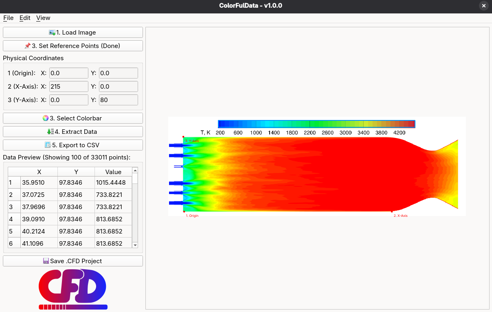

# ColorFulData (CFD)
____
[](./Images/Logo/ColorFulData_Logo.png)
____
**ColorFulData** is an open-source application for extracting numerical data from a reference color-coded image based on the user-defined reference grid and color map with corresponding value range.

## Introduction
*"We've all been there, whether its for validation of a developed model, comparison of numerical simulations with those from literature or similar cases alike. Quite often the source data is not publicly available, so the images/colormaps are the only thing we can work with. But what if it wouldn't have to be like that? What if we could within certain accuracy extract the numerical data we're so interested in? Well this is exactly the reasoning which led to the ColorFulData (CFD) application."*

[](./Images/Figures4GitHub/Demo_BKD_CFD.png)
Figure 1: Demonstration of the application's UI, with an example of a data extraction based on a time-averaged temperature contour from the work of [Zhu et al.](https://www.researchgate.net/publication/388936464_Simulation_of_Multi-Injector_H2-O2_Rocket_Combustion_Instability)
____


## Overview
**Version: v1.0.0**

___
## Installation
Installation of the application can be done in two ways (or both if you like) the choice mainly depends on how comfortable the user is with the terminal and programming (Python).

If you are comfortable with coding and using the terminal, then proceed by downloading the GitHub repository [Instructions](#download-repository).

If you prefer a more graphical experience, without the need for coding or interacting with the terminal, no worries we got you covered! In this case, you can select the download for the executable of the application for your OS of choice: [Download Executable](#download-executable)
### Download Repository

Installation steps from downloaded repository:
**Manual**
1. Extract the compressed folder in your desired location
2. Open the extracted folder
(OPTIONAL): you can open the folder using Visual Studio Code
3. Create a virtual environment (either via terminal or VScode)
```bash
python3 -m venv .venv
```
4. Activate your virtual environment
```bash
source .venv/bin/activate
```
5. Install the dependencies
```bash
pip install -r requirements.txt
```
6. Run the application
```bash
python main.py
```
**Terminal script (download from source)**
```bash
git clone https://github.com/BramS515/ColorFulData
cd ColorFulData
python3 -m venv .venv
source .venv/bin/activate
pip install -r requirements.txt
```
Once installed, similar to the other method use `python main.py` to run the script.

### Download Executable
**===WORK IN PROGRESS===**
* [](https://example.com) [Download for Windows](https://example.com)
* [](https://example.com) [Download for Linux](https://example.com)
* [](https://example.com) [Download for Mac](https://example.com)
___
## For Contributors/Developers
For active contributors/developers, or people interested in joining the project, relevant information can be found in the [CONTRIBUTING](./CONTRIBUTING.md) page.

## AI Disclosure
The use of generative AI and its scope can be found at: [AI_DISCLOSURE](./AI_DISCLOSURE.md)

## Attributions

* Some icons used in the GUI are icons by [Yusuke Kamiyamane](http://p.yusukekamiyamane.com/). Licensed under a [Creative Commons Attriution 3.0 License](http://creativecommons.org/licenses/by/3.0/)